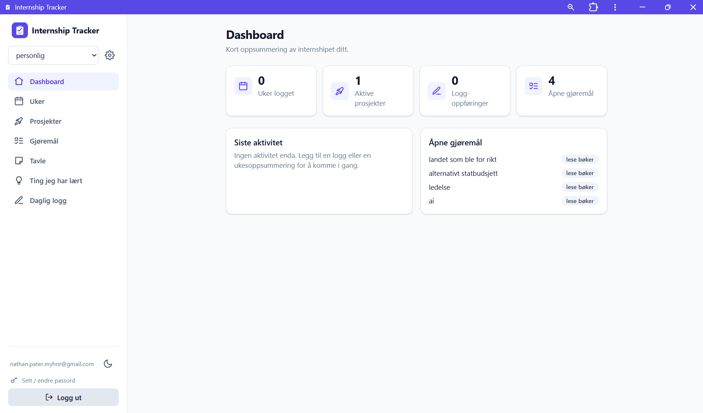
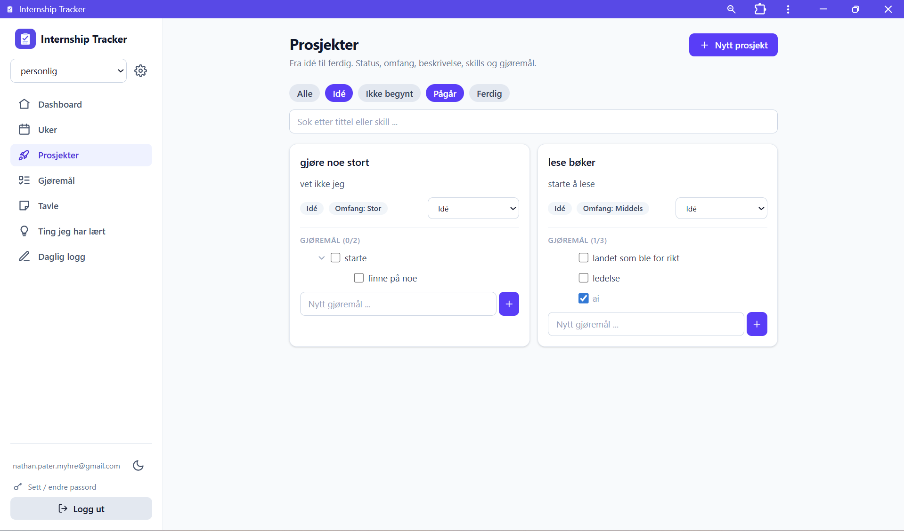
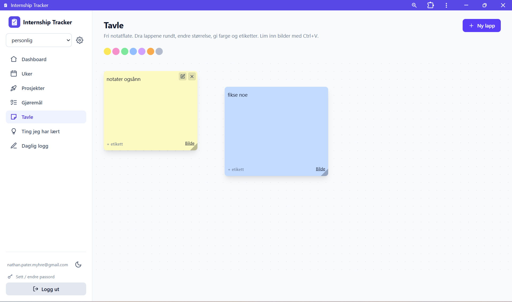

# Internship Tracker

En Progressive Web App for å dokumentere og strukturere et internship: ukesoppsummeringer, prosjekter, gjøremål, læringsnotater, daglig logg og en visuell idétavle.

Appen kan installeres på mobil og PC, og all data synkroniseres mellom enheter.

**Live:** https://internship-tracker-lilac-psi.vercel.app

<!--
Skjermbilder: legg bildene i en mappe "docs/" og fjern kommentaren rundt blokken under.

## Skjermbilder

| Dashboard | Prosjekter | Tavle |
|---|---|---|
|  |  |  |
-->

## Funksjonalitet

**Flere internships.** Data er knyttet til det enkelte internshipet, så flere perioder kan holdes adskilt. Bytt mellom dem fra menyen.

**Uker.** Oversikt over uker der hver uke kan ha høydepunkter, utfordringer og konkrete arbeidsoppføringer koblet til et prosjekt.

**Prosjekter.** Fra idé til ferdig, med status (Idé / Ikke begynt / Pågår / Ferdig), omfang, beskrivelse og ferdighets-tagger. Filtrering på flere statuser samtidig, og fritekstsøk på tittel og ferdigheter.

**Gjøremål.** Hierarkiske oppgaver med undergjøremål, inline-redigering og dra-og-slipp for både sortering og å gjøre en oppgave om til en deloppgave. Egen fane som samler alle gjøremål på tvers av prosjekter.

**Tavle.** Fri notatflate med flyttbare og skalerbare lapper. Farger, etiketter, filtrering og bilder, både via opplasting og innliming fra utklippstavlen.

**Læringsnotater og daglig logg.** Korte notater med kategori og dato, og en løpende dagbok.

**Lys og mørk modus**, responsivt design fra mobil til stor skjerm.

## Teknisk

| Område | Valg |
|---|---|
| Frontend | React, Vite, React Router |
| Styling | Tailwind CSS |
| Backend | Supabase (PostgreSQL, Auth, Storage) |
| PWA | vite-plugin-pwa (service worker + manifest) |
| Hosting | Vercel, med automatisk utrulling fra GitHub |

### Datamodell og sikkerhet

Databasen består av tabeller for internships, uker, arbeidsoppføringer, prosjekter, gjøremål, notater, læringspunkter og daglig logg.

Tilgangskontroll håndheves i databasen med **Row Level Security**, ikke bare i klienten. Hver tabell har egne policyer for `select`, `insert`, `update` og `delete` som sikrer at en bruker kun kan lese og endre sine egne rader:

```sql
create policy "projects_select" on public.projects
  for select using (auth.uid() = user_id);
```

Bilder lagres i Supabase Storage, der opplasting er begrenset til brukerens egen mappe.

Skjemaet er utviklet inkrementelt gjennom nummererte migrasjoner i [`supabase/`](supabase/), fra det opprinnelige oppsettet til støtte for flere internships, prosjekt-gjøremål, undergjøremål, sortering og notattavle.

### Autentisering

Innlogging med e-post og passord via Supabase Auth. Løsningen ble bevisst endret fra innloggingslenke på e-post til passord, fordi lenker alltid åpnes i nettleseren og dermed ikke logger brukeren inn i den installerte app-versjonen.

## Kjøre lokalt

Krever Node.js 18 eller nyere.

```bash
npm install
npm run dev
```

Opprett en `.env`-fil basert på [`.env.example`](.env.example):

```env
VITE_SUPABASE_URL=https://ditt-prosjekt.supabase.co
VITE_SUPABASE_ANON_KEY=din-publishable-key
```

Kjør deretter SQL-filene i [`supabase/`](supabase/) i rekkefølge i Supabase SQL Editor for å sette opp tabeller og sikkerhetspolicyer.

## Prosjektstruktur

```
src/
  components/   Layout, innlogging, gjøremålstre, delte UI-komponenter
  context/      Auth, valgt internship, lys/mørk tema
  hooks/        useCollection, generisk CRUD mot Supabase
  lib/          Supabase-klient, dato- og sorteringshjelpere
  pages/        Dashboard, Uker, Prosjekter, Gjøremål, Tavle, Lært, Logg
supabase/       Databaseskjema og migrasjoner
```
